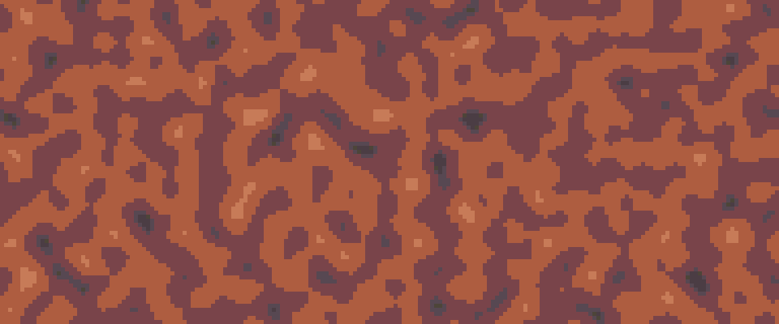
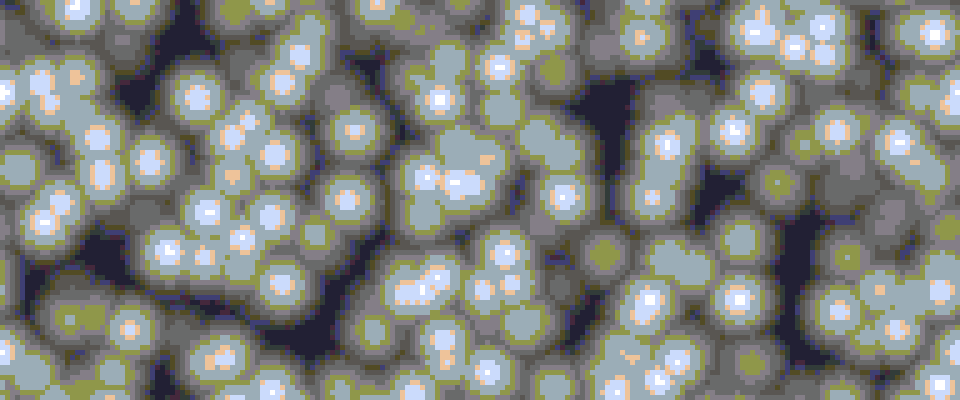

# noise.aseprite-extension

This plugin is meant to enhance aseprite with various pseudo-random noise generation methods.

## Acknowledgements

The initial foothold for this package was enabled by *shemake*'s excellent makeNoise script. In
particular, the later-mentioned dot noise method. I had never written an aseprite extension before 
this one, so this gave me a good idea of how to approach the scripting. Said script can be found at 
[the shemake site](https://shemake.dev/tech/viewing/Aseprite_makeNoise)
(https://shemake.dev/tech/viewing/Aseprite_makeNoise).

Most methods were translations / modifications of existing source code from Wikipedia and elsewhere. 
You can find most attributions inlined in the code itself.

The dynamic library source code uses some Lua helper methods inspired by / borrowed directly from the 
Aseprite source code at `${ASEPRITE_SOURCE_LOCATION}/src/app/script/luacpp.cpp`. Given that this is
a plugin for the respective software, I hope this is alright.

## Noise Method Support

1. "Dot" noise. I don't know an official name, but this refers simply to randomly placing dots of
   the foreground color or current brush around the canvas with a certain chance per pixel.
2. Perlin noise. The quintessential pseudo-random noise function.
    * +Animation.
    * +Tiling.
    
3. Voronoi noise.
    * +Animation.
    
4. Worley noise.
    * +Animation.
    * +Tiling.
    

## Usage

The plugin dialog can be invoked by going to `Edit > Generate > Generate Noise`. From there the 
method of noise can be selected, and custom method settings can be selected by clicking the `Method
Options` button to open a separate options menu.

Note: many method options relating to tiling require that respective lengths (e.g., movement for
Worley animation) be factors of one another.

## Animation

All methods except dot noise currently support some form of animation.[^1]

[^1]: This is only true if you have dynamic libraries enabled and installed in the package folder.
The current implementation of Worley noise for Lua is very slow so it only uses 2D generation,
making animation impossible for the pure Lua plugin as of now.

## Installation

```bash
# clone the repository and load any of its dependencies
git clone https://github.com/Cartier1288/noise.aseprite-extension noise
cd noise
git pull
git submodule update --init --recursive
# build the dynamic library extension (this part can be skipped if you don't want it)
mkdir build
cd build
cmake \
    -DCMAKE_BUILD_TYPE=Release \
    -DEXCLUDE_TESTS=1 \
    ..
make install
cd ..
# build the package itself -- zip it into a file called noise.aseprite-extension
./package.sh
```

If your system has `.aseprite-extension` registered to aseprite, you should just be able to open the
file and have it automatically add the extension for you.

Otherwise, open the generated `noise.aseprite-extension` package from within aseprite by going to
`Edit > Preferences > Extensions`, clicking on `Add Extension` and navigating to the package and
opening it.

### Dynamic Linking Problems

[This GitHub comment](https://github.com/aseprite/aseprite/issues/2965#issuecomment-1604429397) 
from _dacap_ himself seems to suggest that dynamic libraries are not supported in plugins. My 
experience is that my purchased Windows installation allows for the dynamic library to be loaded 
without issue.

However, having compiled aseprite on Arch Linux I found that I _was_ receiving an error when 
trying to link the library. This was easily fixed by adding the following lines to
`${ASEPRITE_SOURCE_LOCATION}/third_party/CMakeLists.txt:204` (under lua linking):

```cmake
target_compile_definitions(lua PUBLIC LUA_USE_DLOPEN)
target_compile_definitions(lauxlib PUBLIC LUA_USE_DLOPEN)
target_compile_definitions(lualib PUBLIC LUA_USE_DLOPEN)
```
and then compoling again.

Technically, this package can be used without the dynamic library extension. Worley noise will be
violently slow and lack animation, but it does avoid the extra steps of having to compile it.

I haven't tried using the purchased installer for Debian, so I cannot vouch for whether it will work
automatically like it did for Windows.

### Dynamic Linking Warnings

As far as I am aware, the reason behind dynamic libraries not being innately supported by Lua is 
two-fold:
1. they are not directly supported by the C standard, and
2. they pose a security risk.

To address the latter: Lua provides an isolated programming environment that can at least somewhat
be curated by the program that it is embedded in. Enabling dynamic libraries throws this out of the
window head-first. It means that any program at all with a compatible Lua interface can be linked
and run, which can then access the internet, delete files, etc.

You can see the source code for this package and verify for yourself whether it does any of this (it
does not). But for this reason, care should be taken when enabling dynamic linking if you are 
unfamiliar with other extensions and their source code.

Interestingly, I found that the Lua `package.loadlib` function gave a warning about loading
libraries even when I did not have `LUA_USE_DLOPEN` set. Since this function requires a direct link 
to the library file, I opted to use `require` which also happened to give no such warnings. It was 
my expectation that require would wrap `loadlib` when loading a dynamic library, so I was surprised 
to see that. Just know that as far as I am aware you will not be given a warning about loading 
the library when using the plugin.


### Disclaimer

This is a new extension. There are definitely as of yet undetermined bugs. All of the primary 
functionality gets tested often, but it's probably best to make a backup of files / layers before 
using it.